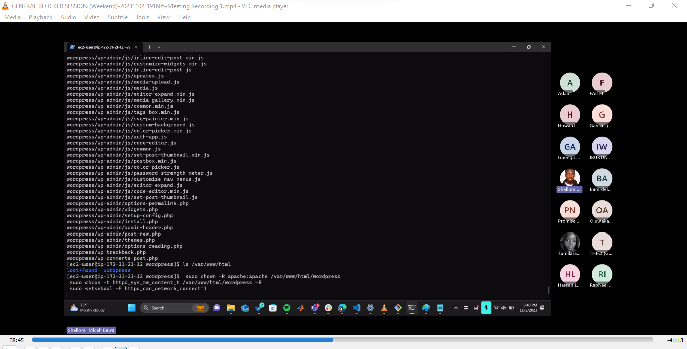
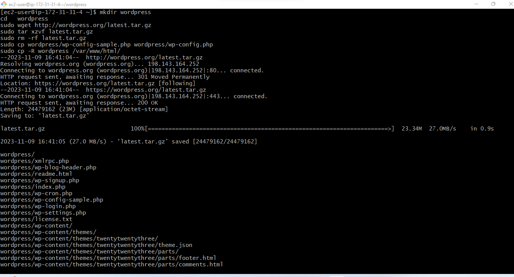

# IMPLEMENTING LVM ON LINUX SERVERS (WEB SERVER AND DATABASE SERVER)

## PREREQUISTE

- Two cloud  servers: a webserver and a database server  
- Both servers to run on RedHatLinux os
- Linux Terminal(Git Bash)
- Ability to connect the terminal to the cloud environment using SSH.

# STEP 1 SPIN UP TWO INSTANCES 

Spin up two instance to run on RedHat linux os: a webserver and a database server

connnect the webserver to the terminal by doing SSH

Create the volumes for the web server

Attach the volumes for the web server

# STEP 2 CONFIGURING THE WEBSERVER

## Open the server and use the command to inspect the volumes

`lsblk`

- The volumes names are: xvdf, xvdg and xvdh

- To check all mounts and free space on server

## Create single partion for each volume

Volume 1

`sudo gdisk /dev/xvdf`

Volume 2

`sudo gdisk /dev/xvdg`

Volume 3

`sudo gdisk /dev/xvdh`

VIew new partitions on web server

# STEP 3 INSTALL LVM 2 PACKAGE

Use the command to install LVM 2 package on RedHat

`sudo yum install lvm2`

Verify lvm installation

To check partition availability

`sudo lvmdiskscan`

Use the `pv create` command to mark the physical volumes to be used by the LVM

`sudo pvcreate /dev/xvdf1 /dev/xvdg1 /dev/xvdh1`

Verify physical volumes are created

`sudo pvs`

Add all three volumes to a volume group VG and verify task.

`sudo vgcreate webdata-vg /dev/xvdh1 /dev/xvdg1 /dev/xvdf1`

`sudo vgs`

Crete and Verify logical volumes

`sudo lvcreate -n app-lv -L 14G webdata-vg`

`sudo lvcreate -n logs-lv -L 14G webdata-vg`

 `sudo lvs`

Verify the entire setup

`sudo vgdisplay -v #view complete setup - VG, PV, and LV`

Format logical volumes with ext4 file system

`sudo mkfs -t ext4 /dev/webdata-vg/app-lv`

sudo mkfs -t ext4 /dev/webdata-vg/logs-lv

Create Var/www/html dirctory to store the website files for the app.

`sudo mkdir -p /var/www/html`

Create home/recovery/logs  to backup previous logged data.

`sudo mkdir -p /home/recovery/logs`

Mount the var/www/hmtl on the app-lv logical volume

sudo mount /dev/webdata-vg/app-lv /var/www/html/

Backup all files in the var/logs directory into the home/recovery/logs

`sudo rsync -av /var/log/. /home/recovery/logs/`

Mount var/log on logs-lv logical volume

`sudo mount /dev/webdata-vg/logs-lv /var/log`

Verify mount

`df -h`

Restore log files back to var/logs directory

`sudo rsync -av /home/recovery/logs/log /var/log`

Update `/etc/fstab` 

`sudo blkid`

`sudo vi /etc/fstab/`

Test configuratiuon, reload daemon and verify setup.

`sudo mount -a`

`sudo systemctl daemon-reload`

`df -h`

INSTALLATION OF WORDPRESSS AND MYSQL DATABASE CONFIGURATION

Update the Repository

`sudo yum -y update`

Install wget, Apache and its dependencies.

`sudo yum install wget httpd php php-mysqlnd php-fpm php-json`

'

Start Apache

`sudo systemctl enable httpd`

`sudo systemctl start httpd`

Install PHP and its Dependencies

`sudo yum install https://dl.fedoraproject.org/pub/epel/epel-release-latest-9.noarch.rpm`
`sudo yum install yum-utils http://rpms.remirepo.net/enterprise/remi-release-9.rpm`
`sudo yum module list php`
`sudo yum module reset php`
`sudo yum module enable php:remi-7.4`
`sudo yum install php php-opcache php-gd php-curl php-mysqlnd`
`sudo systemctl start php-fpm`
`sudo systemctl enable php-fpm`
`sudo setsebool -P httpd_execmem 1`

Restart Apache

`sudo systemctl restart httpd`

Download and copy wordpress to `var/www/html`

`mkdir wordpress`
`cd   wordpress`
`sudo wget http://wordpress.org/latest.tar.gz`
`sudo tar xzvf latest.tar.gz`
`sudo rm -rf latest.tar.gz`
`sudo cp wordpress/wp-config-sample.php wordpress/wp-config.php`
`sudo cp -R wordpress /var/www/html/`

Configure SE policies

 `sudo chown -R apache:apache /var/www/html/wordpress`
` sudo chcon -t httpd_sys_rw_content_t /var/www/html/wordpress -R`
` sudo setsebool -P httpd_can_network_connect=1`

# STEP 4 CONFIGURING DATABASE SERVER SERVER

## Open the server and use the command to inspect the volumes

`lsblk`

- The volumes names are: xvdf, xvdg and xvdh

- To check all mounts and free space on server

## Create single partion for each volume

Volume 1

`sudo gdisk /dev/xvdf`

Volume 2

`sudo gdisk /dev/xvdg`

Volume 3

`sudo gdisk /dev/xvdh`

VIew new partitions on database server

# STEP 5 INSTALL LVM 2 PACKAGE

Use the command to install LVM 2 package on RedHat

`sudo yum install lvm2`

To check partition availability

`sudo lvmdiskscan`

Use the `pv create` command to mark the physical volumes to be used by the LVM

`sudo pvcreate /dev/xvdf1 /dev/xvdg1 /dev/xvdh1`

Verify physical volumes are created

`sudo pvs`

Add all three volumes to a volume group VG and verify task.

`sudo vgcreate database-vg /dev/xvdh1 /dev/xvdg1 /dev/xvdf1`

`sudo vgs`

Create and Verify logical volumes

`sudo lvcreate -n db-lv -L 14G database-vg`

 `sudo lvs`

Verify the entire setup

`sudo vgdisplay -v #view complete setup - VG, PV, and LV`

Format logical volumes with ext4 file system

`sudo mkfs -t ext4 /dev/database-vg/db-lv`

Create Var/db directory to store the website files for the database
`sudo mkdir -p /var/db`

Mount the var/db on the db-lv logical volume

sudo mount /dev/database-vg/db-lv /db

Verify mount

`df -h`

Update `/etc/fstab` 

`sudo blkid`

`sudo vi /etc/fstab/`

Test configuratiuon, reload daemon and verify setup.

`sudo mount -a`

`sudo systemctl daemon-reload`

`df -h`

# STEP 7 Install MYSQL on DATABASE SERVER

`sudo yum update`

`sudo yum install mysql-server`

Run MYSQL Secure Installation

`Sudo mysql_secure_installation`

Verify the system status using the below:

`sudo systemctl status mysqld`

Restart and Enable MYSQL

`sudo systemctl restart mysqld`
`sudo systemctl enable mysqld`

Configure Database to work with Wordpress

`sudo mysql`

`CREATE DATABASE wordpress;`

`CREATE USER `myuser`@`172.31.23.103` IDENTIFIED BY 'password';`

`GRANT ALL ON wordpress.* TO 'myuser'@'172.31.23.103';`

`FLUSH PRIVILEGES;`

`SHOW DATABASES;`

`exit;`

Configure wordpress to connect to remote database

`open port 3306`

# STEP 8 Install MYSQL Client on the Webserver

`sudo yum install mysql -y`

Edit the Server configuration file to allow connection from remote user

`sudo vi /etc/my.cnf`

Restart MYSQL Server and check status

`sudo systemctl restart mysqld`

`sudo mysql -u myuser -ppassword -h 172.31.23.103`

Edit the configuration file for the webserver so Apache could access wordpress

TO make Apache  owner

` sudo chown -R apache:apache /var/www/html/wordpress`

Edit Inbound rule for Webserver for Apache to use port 80

Edit the `wp-config.php` file in wordpress

View wordpress on browser

`https://54.226.17.208/wordpress`

NB: I did save the wordpress password unable to get to the Wordpress welcome page

