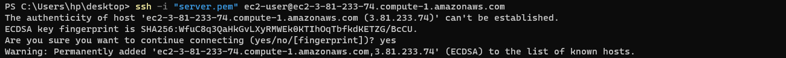

# Self study 

Detail study on the following: 

Network-attached storage (NAS), Storage Area Network (SAN), NFS, (s)FTP, SMB, and iSCSI. 
Have an deep level ubnderstanding of what block-level storage  is and and use by cloud providers,confused-by-aws-storage-options-s3-ebs-amp-efs-explained. In addition to this knowing how block storage differs from objectstorage. Understand the difference in the folloeing : block storage, object storage and network file system.
STEP 1: Creating a Business Website Using NFS For The Backend File Storage.

 
# PRE REQUISITE FOR THE PROJECT 
 
Infrastructure: AWS Cloud
Three Webservers with Rhel 8 operating system
Database Server: One Ubuntu 20.04 + MySQL
Storage Server: One Red Hat Enterprise Linux 8 + NFS Server
Programming Language: PHP

-Details of Rhel 8 AMI used; ami-06640050dc3f556bb (Project 9 Rhel 8 AMI)

-Details of ubuntu Operating system  used for Database : ubuntu version 20.04

# STEP 1 – PREPARE NFS SERVER

Spin up one EC2 instance with RHEL Linux 8 Operating System

Create volumes and attach volumes to the instance 

Connect terminal to AWS clound by doing SSH

check volume 

`lsblk`

To partition the three disksseparately i used the command 

`sudo gdisk /dev/xvdf`

`sudo gdisk /dev/xvdg`

`sudo gdisk /dev/xvdh`

TO check the created paritioned disks

`lsblk`

Install LVM 

`sudo yum install lvm2 -y`

Check for available space

`sudo lvmdiskscan`

USe "pvcreate" tool to dassign each of the three disks as physical volumes 

`sudo pvcreate /dev/xvdf1 /dev/xvdg1 /dev/xvdh1`

check physical volumes

`sudo pvs`

Create volume group from the three physical volume and check volume group

`sudo vgcreate webdata-vg /dev/xvdf1 /dev/xvdg1 /dev/xvdh1`

`sudo vgs` 

Create the three needed logical volumes : lv apps, lv-logs and lv-opt

check logical volumes

`sudo lvcreate -n lv-apps -L 9g webdata-vg`

`sudo lvcreate -n lv-logs -L 9g webdata-vg`

`sudo lvcreate -n lv-opt -L 9g webdata-vg`

`sudo lvs`

To check the entire setup, we use:

`df -h`

Format logical volumes with `xfs` instead of e`xt4` filesystem

`sudo mkfs -t xfs /dev/webdata-vg/lv-apps`

`sudo mkfs -t xfs /dev/webdata-vg/lv-logs`

`sudo mkfs -t xfs /dev/webdata-vg/lv-opt`

create mounts point /mnt/apps, /mnt/logs and /mnt/opt to mount each of the volumes lv-apps, lv-logs and lv-opt as the names imply.

first we need to create directories for each mount points

`sudo mkdir /mnt/apps`
`sudo mkdir /mnt/logs`
`sudo mkdir /mnt/opt`

Mount on all three LV:

`sudo mount /dev/webdata-vg/lv-apps /mnt/apps`
`sudo mount /dev/webdata-vg/lv-logs /mnt/logss`
`sudo mount /dev/webdata-vg/lv-opt /mnt/opt`

`sudo yum -y update`

`sudo yum install nfs-utils -y`
`sudo systemctl start nfs-server.service`
`sudo systemctl enable nfs-server.service`
`sudo systemctl status nfs-server.service`

Set read and write execution permissions
`sudo chown -R nobody: /mnt/apps`
`sudo chown -R nobody: /mnt/logs`
`sudo chown -R nobody: /mnt/opt`
`sudo chmod -R 777 /mnt/apps`
`sudo chmod -R 777 /mnt/logs`
`sudo chmod -R 777 /mnt/opt`
`sudo systemctl restart nfs-server.service`

`sudo vi /etc/exports`

`/mnt/apps <Subnet-CIDR>(rw,sync,no_all_squash,no_root_squash)
/mnt/logs <Subnet-CIDR>(rw,sync,no_all_squash,no_root_squash)
/mnt/opt <Subnet-CIDR>(rw,sync,no_all_squash,no_root_squash)`

`Esc + :wq!`

`sudo exportfs -arv`

Check whick ports are used by NFS and open in Security Group

`rpcinfo -p | grep nfs`

Edit NFS Inbound Rule

# STEP 2 PREPARE THE DATABASE SERVER

Spin up an instance for the database with Ubuntu OS and SSH

Update the installation package

Install MYSQL Server

Log in to MYSQL

`sudo mysql`

Create database and name it tooling

`create database tooling;`

Create User with the SQL query: 

`create user 'webaccess,@'172.31.32.0/20' identified by 'password';`

Grant Privileges to User and flush privileges

`grant all privileges on tooling.* to 'webaccess'@'172.31.32.0/20';`

`flush privileges;`

STEP 3 PREPARE THREE WEBSERVER TO OPERATE ON RHEL 8 OS

Spin up three webservers  with names Web1, Web2 and web3 and SSH into the webservers.

  

Install NFS client on each webserver

`sudo yum install nfs-utils nfs4-acl-tools -y`

  

Mount `/var/www/` and target the NFS server’s export for apps and verify mount

`sudo mkdir /var/www`
`sudo mount -t nfs -o rw,nosuid <NFS-Server-Private-IP-Address>:/mnt/apps /var/www`
 
![Alt text]  

Make sure changes made will persist 

`sudo vi /etc/fstab`

Add the following line 

`172.31.47.181:/mnt/apps /var/www nfs defaults 0 0`

  Readme.md  

Install Remi Repository, Apache and PHP on all three servers: web 1, web 2 and web 3.

`sudo yum install httpd -y`

`sudo dnf install https://dl.fedoraproject.org/pub/epel/epel-release-latest-8.noarch.rpm`

`sudo dnf install dnf-utils http://rpms.remirepo.net/enterprise/remi-release-8.rpm`

`sudo dnf module reset php`

`sudo dnf module enable php:remi-7.4`

`sudo dnf install php php-opcache php-gd php-curl php-mysqlnd`

`sudo systemctl start php-fpm`

`sudo systemctl enable php-fpm`

`sudo setsebool -P httpd_execmem 1`

Repeat steps 1-5 for another 2 Web Servers.

Verify that Apache files and directories are available on the Web Server in /var/www and also on the NFS server in /mnt/apps. If you see the same files – it means NFS is mounted correctly. You can try to create a new file touch test.txt from one server and check if the same file is accessible from other Web Servers.

Install MySQl client on the three webservers

Verification of file created in webservers seen in NFS

 

Locate the log folder for Apache on the Web Server and mount it to NFS server’s export for logs. Repeat step №4 to make sure the mount point will persist after reboot.

`df -h`

`Verified mount on log but lost my screenshot on it; problem with my screenshot software`

Edit the Fstab file for logs on the three webservers

`sudo vi /etc/fstab`

Install `git `on the three webservers

Fork the tooling source code from `darey.io` repo to your Github account.

Deploy the tooling website’s code to the Webserver. Ensure that the html folder from the repository is deployed to /var/www/html

Note 1: Do not forget to open TCP port 80 on the Web Server. Note 2: If you encounter 403 Error – check permissions to your /var/www/html folder and also disable SELinux `sudo setenforce 0` To make this change permanent – open following config file `sudo vi /etc/sysconfig/selinux` and set SELINUX=disabled then restart httpd.

Update the website’s configuration to connect to the database 

`sudo vi /var/www/html/functions.php`

Edit the Database `binding Address file`with the command:

`sudo vi /etc/mysql/mysql.conf.d/mysqld.cnf`

Apply tooling-db.sql script or schema to the database from the webserver 3 using this command 

`mysql -h <databse-private-ip> -u <db-username> -p <db-name> < tooling-db.sql`

`Note: Connection was successful but i was log-out of AWS on several occassions on different occassions`

Confirm this work in the database 

Create in MySQL a new admin user with username: myuser and password: password: INSERT INTO ‘users’ (‘id’, ‘username’, ‘password’, ’email’, ‘user_type’, ‘status’) VALUES -> (1, ‘myuser’, ‘5f4dcc3b5aa765d61d8327deb882cf99’, ‘user@mail.com’, ‘admin’, ‘1’);

Open the website in your browser http://webserver ip address/index.php and make sure you can login into the website with myuser user.

  
