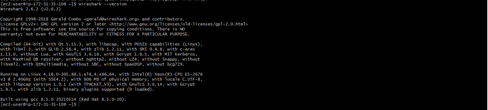
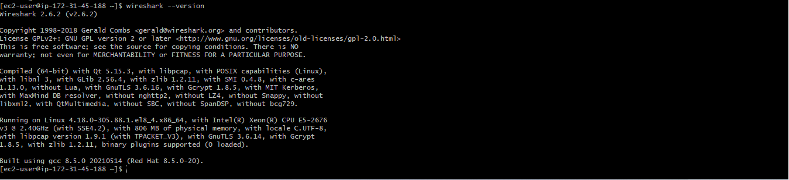

# ANSIBLE CONFIGURATION MANAGEMENT – AUTOMATE

Ansible Client as a Jump Server also called Bastion Host is an mid-server through which access to internal network can be provided. If you think about the current architecture you are working on, ideally, the webservers would be inside a secured network which cannot be reached directly from the Internet. That means, even DevOps engineers cannot SSH into the Web servers directly and can only access it through a Jump Server – it provide better security and reduces attack surface. On the diagram below the Virtual Private Network (VPC) is divided into two subnets – Public subnet has public IP addresses and Private subnet is only reachable by private IP addresses.

## Task To Do 
Spinup and Instance, name Jenkins-Ansible and SSH

Install and configure Ansible client to act as a Jump Server

`sudo apt update `

`sudo apt install ansible`

Check your Ansible version by running 

`ansible --version`

In your GitHub account create a new repository and name it ansible-config-mgt.
Install Jenkins

Check Jenkins status

Configure Jenkins build job to save your repository content every time you change it – this will solidify your Jenkins configuration skills acquired in Project 9.

   

Create a new Freestyle project ansible in Jenkins and point it to your ‘ansible-config-mgt’ repository.

Configure Webhook in GitHub and set webhook to trigger ansible build.

Configure a Post-build job to save all (**) files, like you did it in Project 9.
jenkins job 1 (done will doing freestyle job)

Edit jenkin Inbound rule

Test your setup by making some change in README.MD file in main branch and make sure that builds starts automatically and Jenkins saves the files (build artifacts) in following folder

ls /var/lib/jenkins/jobs/ansible/builds/<build_number>/archive/

# Step 2 – Prepare your development environment using Visual Studio Code
First part of ‘DevOps’ is ‘Dev’, which means you will require to write some codes and you shall have proper tools that will make your coding and debugging comfortable – you need an Integrated development environment (IDE) or Source-code Editor. There is a plethora of different IDEs and Source-code Editors for different languages with their own advantages and drawbacks, you can choose whichever you are comfortable with, but we recommend one free and universal editor that will fully satisfy your needs – Visual Studio Code (VSC)

After you have successfully installed VSC, configure it to connect to your newly created GitHub repository.

# STEP 3 Clone down your ansible-config-mgt repo to your Jenkins-Ansible instance

git clone done already

BEGIN ANSIBLE DEVELOPMENT
In your ansible-config-mgt GitHub repository, create a new branch that will be used for development of a new feature.
Tip: Give your branches descriptive and comprehensive names, for example, if you use Jira or Trello as a project management tool – include ticket number (e.g. PRJ-145) in the name of your branch and add a topic and a brief description what this branch is about – a bugfix, hotfix, feature, release (e.g. feature/prj-145-lvm)

Checkout the newly created feature branch to your local machine and start building your code and directory structure

`git fetch`
`git switch feat/prj-11`

Create a directory and name it playbooks – it will be used to store all your playbook files.
Create a directory and name it inventory – it will be used to keep your hosts organised.

`mkdir playbooks inventory`

Within the playbooks folder, create your first playbook, and name it common.yml

`cd playbooks`

`touch common.yml`

Within the inventory folder, create an inventory file (.yml) for each environment (Development, Staging Testing and Production) dev, staging, uat, and prod respectively.
ansible folders

`touch dev.yml staging.yml uat.yml prod.yml`

# Step 4 – Set up an Ansible Inventory
An Ansible inventory file defines the hosts and groups of hosts upon which commands, modules, and tasks in a playbook operate. Since our intention is to execute Linux commands on remote hosts, and ensure that it is the intended configuration on a particular server that occurs. It is important to have a way to organize our hosts in such an Inventory.

Save below inventory structure in the inventory/dev file to start configuring your development servers. Ensure to replace the IP addresses according to your own setup.
Note: Ansible uses TCP port 22 by default, which means it needs to ssh into target servers from Jenkins-Ansible host – for this you can implement the concept of ssh-agent. Now you need to import your key into ssh-agent:

To learn how to setup SSH agent and connect VS Code to your Jenkins-Ansible instance, please see this video: • For Windows users – ssh-agent on windows • For Linux users – ssh-agent on linux

eval `ssh-agent -s`
ssh-add <path-to-private-key>
Confirm the key has been added with the command below, you should see the name of your key ssh-add -l

Now, ssh into your Jenkins-Ansible server using ssh-agent ssh -A ubuntu@public-ip

ssh

ssh check

Also notice, that your Load Balancer user is ubuntu and user for RHEL-based servers is ec2-user.

Update your inventory/dev.yml file with this snippet of code:

[nfs]
<NFS-Server-Private-IP-Address> ansible_ssh_user='ec2-user'

[webservers]
<Web-Server1-Private-IP-Address> ansible_ssh_user='ec2-user'
<Web-Server2-Private-IP-Address> ansible_ssh_user='ec2-user'

[db]
<Database-Private-IP-Address> ansible_ssh_user='ec2-user' 

[lb]
<Load-Balancer-Private-IP-Address> ansible_ssh_user='ubuntu'

CREATE A COMMON PLAYBOOK

# Step 5 – Create a Common Playbook

It is time to start giving Ansible the instructions on what you needs to be performed on all servers listed in inventory/dev. In common.yml playbook you will write configuration for repeatable, re-usable, and multi-machine tasks that is common to systems within the infrastructure.

Update your playbooks/common.yml file with following code:

---
- name: update web and nfs servers
  hosts: webservers, nfs
  remote_user: ec2-user
  become: yes
  become_user: root
  tasks:
    - name: ensure wireshark is at the latest version
      yum:
        name: wireshark
        state: latest

- name: update LB and DB server
  hosts: lb, db
  remote_user: ubuntu
  become: yes
  become_user: root
  tasks:
    - name: Update apt repo
      apt: 
        update_cache: yes

    - name: ensure wireshark is at the latest version
      apt:
        name: wireshark
        state: latest
Examine the code above and try to make sense out of it. This playbook is divided into two parts, each of them is intended to perform the same task: install wireshark utility (or make sure it is updated to the latest version) on your RHEL 8 and Ubuntu servers. It uses root user to perform this task and respective package manager: yum for RHEL 8 and apt for Ubuntu.

# Step 6 – Update GIT with the latest code

Now all of your directories and files live on your machine and you need to push changes made locally to GitHub. It is important to learn how to collaborate with help of GIT. In many organisations there is a development rule that do not allow to deploy any code before it has been reviewed by an extra pair of eyes – it is also called "Four eyes principle". Now you have a separate branch, you will need to know how to raise a Pull Request (PR), get your branch peer reviewed and merged to the master branch.

Commit your code into GitHub: 16. use git commands to add, commit and push your branch to GitHub.

`git status`

`git add <selected files>`

`git commit -m "commit message"`

   

Create a Pull request (PR)
Head back on your terminal, checkout from the feature branch into the master, and pull down the latest changes.

`git pull`

Once your code changes appear in master branch – Jenkins will do its job and save all the files (build artifacts) to /var/lib/jenkins/jobs/ansible/builds/<build_number>/archive/ directory on Jenkins-Ansible server.

jenkins build

confirm jenkins build

# Step 7 – Run first Ansible test

Now, it is time to execute ansible-playbook command and verify if your playbook actually works:

`cd ansible config-mgt`

`ansible-playbook -i inventory/dev.yml playbooks/common.yml`

You can go to each of the servers and check if wireshark has been installed by running which wireshark or wireshark --version

    

Congratulations!! You have just automated your routine tasks by implementing your first Ansible project!
