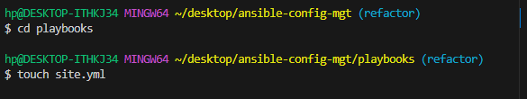
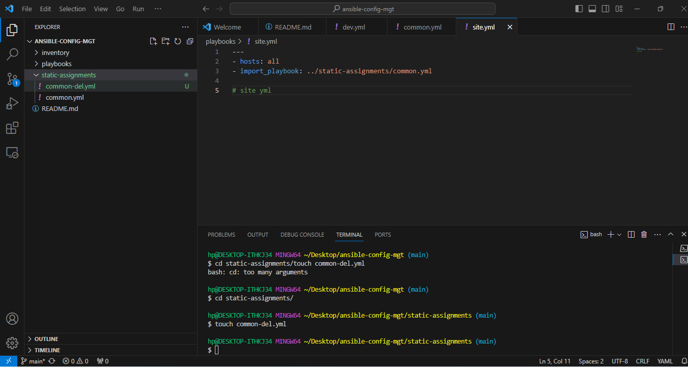
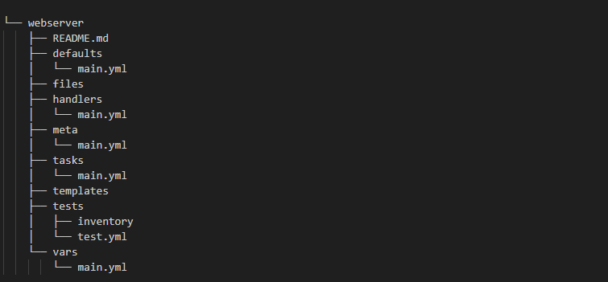
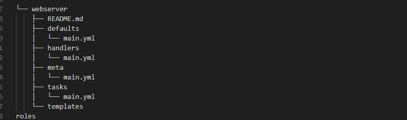

# ANSIBLE REFACTORING AND STATIC ASSIGNMENTS (IMPORTS AND ROLES)

As a  continuuation of the ansible-config-mgt repository and we will make  some improvements to the codes. Ansible code needs to be refactored ,  assignments created and learning how to use the imports functionality. Imports allow to effectively re-use previously created playbooks in a new playbook – it allows you to organize your tasks and reuse them when needed.

Side Self Study: For better understanding or Ansible artifacts re-use – read this article.
Code Refactoring
Refactoring is a general term in computer programming. It means making changes to the source code without changing expected behaviour of the software. The main idea of refactoring is to enhance code readability, increase maintainability and extensibility, reduce complexity, add proper comments without affecting the logic. In your case, you will move things around a little bit in the code, but the overal state of the infrastructure remains the same. Let us see how you can improve your Ansible code!

# Step 1 – Jenkins job enhancement
Before we begin, let us make some changes to our Jenkins job – now every new change in the codes creates a separate directory which is not very convenient when we want to run some commands from one place. Besides, it consumes space on Jenkins server with each subsequent change. Let us enhance it by introducing a new Jenkins project/job – we will require Copy Artifact plugin.

1. Go to your Jenkins-Ansible server and create a new directory called ansible-config-artifact – we will store there all artifacts after each build.

`sudo mkdir /home/ubuntu/ansible-config-artifact`

2. Change permissions to this directory, so Jenkins could save files there – chmod -R 0777 /home/ubuntu/ansible-config-artifact

3. Go to Jenkins web console -> Manage Jenkins -> Manage Plugins -> on Available tab search for `Copy Artifact` and install this plugin without restarting Jenkins

jenkins plugin install

Create a new Freestyle project (you have done it in Project 9) and name it save_artifacts.

)

This project will be triggered by completion of your existing ansible project. Configure it accordingly:

jenkins 1

Note: You can configure number of builds to keep in order to save space on the server, for example, you might want to keep only last 2 or 5 build results. You can also make this change to your ansible job.

The main idea of save_artifacts project is to save artifacts into /home/ubuntu/ansible-config-artifact directory. To achieve this, create a Build step and choose Copy artifacts from other project, specify ansible as a source project and /home/ubuntu/ansible-config-artifact as a target directory.
jenkins 2

Test your set up by making some change in README.MD file inside your ansible-config-mgt repository (right inside master branch).
If both Jenkins jobs have completed one after another – you shall see your files inside /home/ubuntu/ansible-config-artifact directory and it will be updated with every commit to your master branch. Now your Jenkins pipeline is more neat and clean.

`Note:  I had some issues with getting a build I had to troubleshoot to fix the problem that was when I got my first build`

` ls /var/lib/jenkins/jobs/ansible/builds`

# REFACTOR ANSIBLE CODE BY IMPORTING OTHER PLAYBOOKS INTO SITE.YML

# Step 2 – Refactor Ansible code by importing other playbooks into site.yml
Before starting to refactor the codes, ensure that you have pulled down the latest code from master (main) branch, and created a new branch, name it refactor.

`git checkout -b refactor`

Let see code re-use in action by importing other playbooks.

1. create a new file and name it site.yml – This file will now be considered as an entry point into the entire infrastructure configuration. Other playbooks will be included here as a reference. In other words, site.yml will become a parent to all other playbooks that will be developed. Including common.yml that you created previously. Dont worry, you will understand more what this means shortly.

`touch site.yml`

2. Create a new folder in root of the repository and name it static-assignments. The static-assignments folder is where all other children playbooks will be stored. This is merely for easy organization of your work. It is not an Ansible specific concept, therefore you can choose how you want to organize your work. You will see why the folder name has a prefix of static very soon. For now, just follow along.

`mkdir static-assignments`

3. Move common.yml file into the newly created static-assignments folder.

`mv common.yml /c/Users/hp/Desktop/ansible-config-mgt/static-assignments`

 

4. Inside site.yml file, import common.yml playbook.

# check 2

Run ansible-playbook command against the dev environment.

you can go ahead and create another playbook under static-assignments and name it common-del.yml. In this playbook, configure deletion of wireshark utility.

`touch common-del.yml`

# `---
- name: update web, nfs and db servers
  hosts: webservers, nfs, db
  remote_user: ec2-user
  become: yes
  become_user: root
  tasks:
  - name: delete wireshark
    yum:
      name: wireshark
      state: removed

- name: update LB server
  hosts: lb
  remote_user: ubuntu
  become: yes
  become_user: root
  tasks:
  - name: delete wireshark
    apt:
      name: wireshark-qt
      state: absent
      autoremove: yes
      purge: yes
      autoclean: yes`

update site.yml with - `import_playbook: ../static-assignments/common-del.yml` instead of common.yml and run it against dev servers:

`cd /home/ubuntu/ansible-config-artifact/`

`ansible-playbook -i inventory/dev.yml playbooks/site.yaml`

Make sure that wireshark is deleted on all the servers by running wireshark --version

ansible confirm

Now you have learned how to use import_playbooks module and you have a ready solution to install/delete packages on multiple servers with just one command.

# CONFIGURE UAT WEBSERVERS WITH A ROLE ‘WEBSERVER’
# Step 3 – Configure UAT Webservers with a role ‘Webserver’
We have our nice and clean dev environment, so let us put it aside and configure 2 new Web Servers as uat. We could write tasks to configure Web Servers in the same playbook, but it would be too messy, instead, we will use a dedicated role to make our configuration reusable.

Launch 2 fresh EC2 instances using RHEL 8 image, we will use them as our uat servers, so give them names accordingly – Web1-UAT and Web2-UAT.

To create a role, you must create a directory called roles/, relative to the playbook file or in /etc/ansible/ directory.

There are two ways how you can create this folder structure:

Use an Ansible utility called ansible-galaxy inside ansible-config-mgt/roles directory (you need to create roles directory upfront)
mkdir roles cd roles ansible-galaxy init webserver

Create the directory/files structure manually
Note: You can choose either way, but since you store all your codes in GitHub, it is recommended to create folders and files there rather than locally on Jenkins-Ansible server.

`mkdir roles`

`cd roles`

The entire folder structure should look like below, but if you create it manually – you can skip creating tests, files, and vars or remove them if you used ansible-galaxy

        
Note:  Roles were created manually because I use windows base system and WSL is not working on my system. I did not creat the unnecessary directories and files, but only the needed files and directories. The roles structure should look like this:

Update your inventory ansible-config-mgt/inventory/uat.yml file with IP addresses of your 2 UAT Web servers

`uat-webservers]`
`<Web1-UAT-Server-Private-IP-Address> ansible_ssh_user='ec2-user'`
`<Web2-UAT-Server-Private-IP-Address> ansible_ssh_user='ec2-user' `

NOTE: TO COPY YOUR KEYPAIR FROM YOUR LOCAL MACHINE INTO YOUR EC2 INSTANCE USE SCP

In /etc/ansible/ansible.cfg file uncomment roles_path string and provide a full path to your roles directory roles_path = /home/ubuntu/ansible-config-mgt/roles, so Ansible could know where to find configured roles.
roles update

`sudo vi /etc/ansible/ansible.cfg`

It is time to start adding some logic to the webserver role. Go into tasks directory, and within the main.yml file, start writing configuration tasks to do the following:
Install and configure Apache (httpd service)
Clone Tooling website from GitHub https://github.com//tooling.git.
Ensure the tooling website code is deployed to /var/www/html on each of 2 UAT Web servers.
Make sure httpd service is started
Your main.yml may consist of following tasks:

---
- name: install apache
  become: true
  ansible.builtin.yum:
    name: "httpd"
    state: present

- name: install git
  become: true
  ansible.builtin.yum:
    name: "git"
    state: present

- name: clone a repo
  become: true
  ansible.builtin.git:
    repo: https://github.com/Koleshky1/tooling.git
    dest: /var/www/html
    force: yes

- name: copy html content to one level up
  become: true
  command: cp -r /var/www/html/html/ /var/www/

- name: Start service httpd, if not started
  become: true
  ansible.builtin.service:
    name: httpd
    state: started

- name: recursively remove /var/www/html/html/ directory
  become: true
  ansible.builtin.file:
    path: /var/www/html/html
    state: absent

`
`https://github.com/koleshky1/tooling`

# REFERENCE WEBSERVER ROLE

# Step 4 – Reference ‘Webserver’ role
Within the static-assignments folder, create a new assignment for uat-webservers uat-webservers.yml. This is where you will reference the role.

---
- hosts: uat-webservers
  roles:
     - webserver

Remember that the entry point to our ansible configuration is the site.yml file. Therefore, you need to refer your uat-webservers.yml role inside site.yml.

So, we should have this in site.yml

---
- hosts: uat-webservers
- import_playbook: ../static-assignments/uat-webservers.yml

# Step 5 – Commit & Test

Commit your changes, create a Pull Request and merge them to master branch, make sure webhook triggered two consequent Jenkins jobs, they ran successfully and copied all the files to your Jenkins-Ansible server into /home/ubuntu/ansible-config-artifact/ directory.

Now run the playbook against your uat inventory and see what happens:

`cd ansible-config-artifact/ sudo ansible-playbook -i inventory/uat.yml playbooks/site.yml`

You should be able to see both of your UAT Web servers configured and you can try to reach them from your browser:

http://<Web1-UAT-Server-Public-IP-or-Public-DNS-Name>/index.php

Congratulations! You have learned how to deploy and configure UAT Web Servers using Ansible imports and roles!

