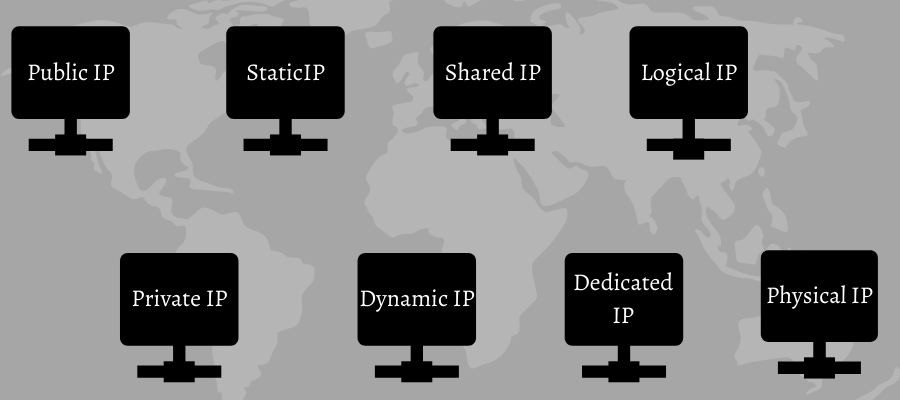
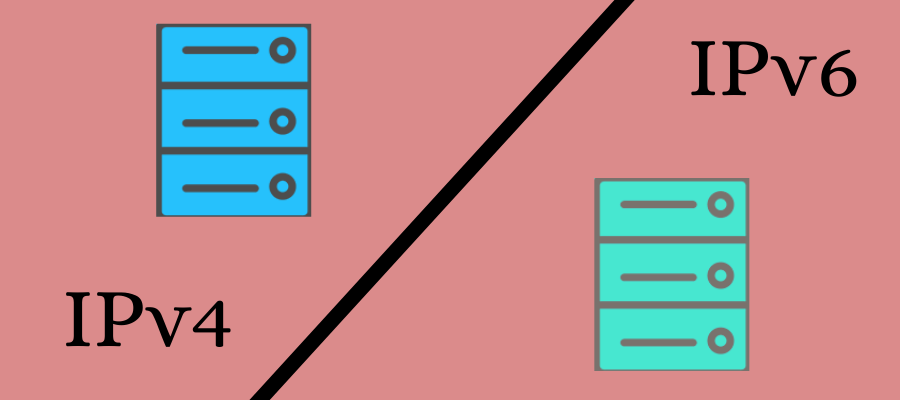
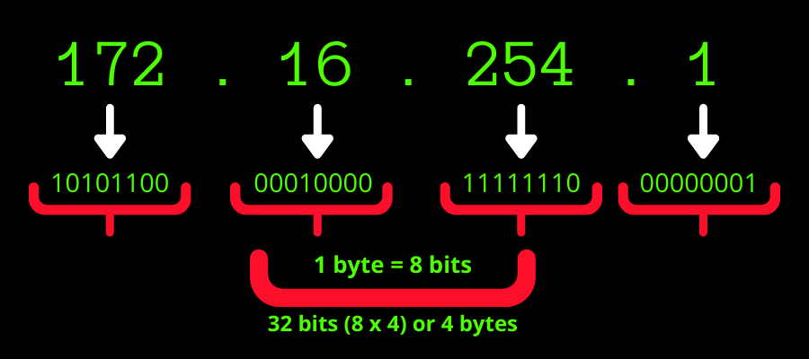
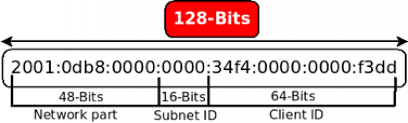
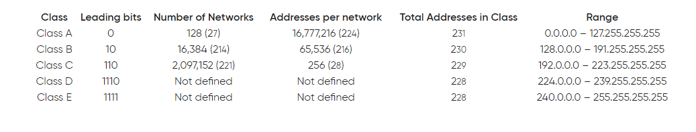

# WHAT ARE IP ADDDRESSES

An Internet Protocol Address (IP address) refers to a unique address or numerical label designated for each device connected in a computer network using the Internet Protocol (IP) for communication.

Example of an IP address: 192.16.2.1

Simply put, IP addresses identify a device on a local network or the internet and allow data to be transmitted between the devices, containing location information while making devices accessible for easy communication. IP addresses offer a great way of differentiating between different devices like computers, printers, websites, routers, etc.

An IP address is used for two purposes:

Location finding
Identifying host/network interface
The Internet Assigned Numbers Authority (IANA) manages IP addresses globally. And, 5 Regional Internet Registries (RIRs) manage them in designated regions and assign them to local internet registries like end-users and Internet Service Providers (ISPs).

# How Does An IP Address Work?

An IP address works in the same way as your house address does for you. If you want to receive a letter or a parcel from a courier, you need to give the sender your house address. Similarly, if you want to receive electronic mail or data from the web, your connected device or computer needs to have an internet address so that the sender can identify it and send the data.

Whether it is your computer, tablet, smartphone, smart lights, thermostat, baby monitor, or anything else connected to the internet, every device has to have an internet number or address to establish a connection and communicate with other devices using a set of guidelines or protocols.

This is why every site like Amazon or Netflix also consists of an IP address to communicate with you and send the information you requested. However, they keep a name instead of their IP address, for example, Amazon.com and Netflix.com, to help you find them easily. Otherwise, you had to type this long set of numbers for every site you visit. Names are easier to remember than numbers.

Now, you may ask how IP addresses are allocated to each device.

An IP address is not random; it is produced mathematically and allocated by the IANA.

In the above example of an IP address – 192.16.2.1, you can see that it is represented as a set of 4 numbers separated by a period. Each number can range from 0 to 255 in this set. So, the full range of IP addresses can go from 0.0.0.0 to 255.255.255.255.

# Types of IP Addresses

# 1. Public and Private

A business or individual having an internet service has IP addresses of two types: private and public. These IP addresses are based on the network location.

Private IP Address: It is used inside the computer network within your home or office. Every device (computer, smartphone, speakers, smart TV, etc.) connecting to your network consists of a private IP address assigned by your router.
As the usage of different devices is growing, the number of IP addresses at home grows with it. Hence, your router must find a way to detect these systems separately, which is why it generates unique private IP addresses for each of them, differentiating devices on your network. Devices outside the private network will not be able to access the private IP addresses.

Public IP address: It is used outside your home or office computer network. Each device connected to the public network or internet will have its IP address assigned by the Internet Service Provider (ISP). ISPs have a wide range of IP addresses for customers, and they allocate a public IP address to your router.
External devices use public IP addresses to find your device over the internet. A public IP address is of two types: static and dynamic.

# 2. Static and Dynamic

Static IP addresses: They are consistent and don’t change regularly or automatically. Once the ISP assigns it, the IP stays the same.
Every business or individual does not need a static IP address. But if you want to host your own server, you must have a static IP address. It ensures your email address and sites tied to a static IP address have the same IP consistently. As a result, external devices can find you easily on the internet.

Dynamic IP address: These IP addresses change regularly and automatically, unlike static addresses. ISPs have a pool of unassigned IP addresses, which they assign to customers who sign in to their internet service. A customer uses the assigned IP address as long as they are connected to the internet. When the customer stops using the service or disconnects from the internet, the assigned IP address becomes free and returns to the pool of unassigned IP addresses. These dynamic addresses are re-assigned to other customers.
This approach saves ISPs costs, and they don’t need to perform specific tasks to re-establish a user’s IP address time and again. In addition, it also ensures security as changing IP addresses makes it difficult for hackers to zero in on one user.

We have earlier discussed static IP addresses for businesses wanting to own a server for their sites. Similarly, there are website IP addresses of two types as well.

# 3. Shared and Dedicated IP address

Shared IP address: Website owners relying on a shared hosting service from a web host will get a server shared by other sites. It is suitable for small-scale businesses, bloggers, portfolio sites, etc., where traffic is less. They will have a shared IP address.
Dedicated IP addresses: Larger sites are looking for a more secure option, and pro gamers who want better control over their servers can go for dedicated hosting plans. They can buy a dedicated IP address. It helps you obtain SSL certificates easily and lets you run your FTP server.
Hence, you can share files with different people securely within your organization or go anonymous. Furthermore, you can even access your site with your IP address instead of your domain name.

# 4. Logical and Physical

Logical IP address: It is assigned by the software inside a server or router and may or may not change periodically. For instance, your laptop can have a different IP address if you connect it to another hotspot.
Physical IP address: Every hardware unit is built with a unique IP address that never changes. This is a physical IP address. You can use a resolution protocol to convert a logical IP address to a physical one to identify a device in your IP network.

# IP Versions: IPv4 and IPv6

There are two versions of IP commonly in use – IPv4, and IPv6. Each version represents an IP address in a different way.

# Internet Protocol Version 4 (IPv4)

The original IP version deployed in the Advanced Research Projects Agency Network (ARPANET) for the first time in 1983 was IPv4. It is used widely in many corporations. Due to its prevalence, the terminology “IP address” still commonly refers to those addresses that IPv4 defines.

IPv4 represents an IP address in the form of a 32-bit number, consisting of 4 numbers separated by periods. Each number represents a decimal (base-10) for an 8-digit binary number (base-2) or octet. It allows IP addresses.

As explained earlier, each of the 4 numbers in an IPv4 address ranges from 0-255.

Example: 172.16.254.1, 192.16.2.1, 192.26.254.1, 172.0.16.0, etc.

# Internet Protocol Version 6 (IPv6)

Due to the tremendous growth of the web, IPv4 addresses started depleting around the 1990s. As a result, the scarcity of IP address space became grave to assign them to the ISPs and end-users.

This pressurized the Internet Engineering Task Force (IETF) to innovate and explore technologies to extend the internet’s address capability. They eventually redesigned the IP as IPv6 in 1995. It went through a series of testing until the 2000s when its commercial deployment began.

In IPv6, the address space was increased to 128 bits or 16 octets (from 32 bits or 8 octets in IPv4). IPv6 is represented by 8 sets of 4 hexadecimal digits, where each number set is separated with the help of a colon and may contain letters and digits.

Example: 2001:0DB8:AC10:0000:0011:AAAA:2C4A:FE01

Yes, it’s super long, but some conventions help abbreviate them.

You can eliminate leading zeros from a number group. For example – :0021: can be :21:
Consecutive zeros can be written as a double colon, and it’s allowed only one in an IP address, provided you maintain 8 sections in it.

`Image Source: Wikipedia`

For example, 2001:0DB8:AC10::0011 would need you to add four sections of zeros instead of a double colon. It becomes, 2001:0DB8:AC10:0000:0000:0000:0000:0011.

The intention behind creating IPv6 is to expand the space and redesign routing by aggregating subnetwork routing prefixes more efficiently. It slowed down routing tables growing in the routers. It also changes the routing prefix of the whole network automatically. So, even if the routing policy or global connectivity policy changes, it won’t need manual renumbering or internal redesigning.

You may ask why IP versions 4 and 6, where are others between and after them?

Here’s the answer.

In reality, other versions were defined, from versions 1 to 9, but only versions 4 and 6 found widespread use. Version 1 and 2 were TCP protocol names in 1974 and ’77 to separate the IP specification at that time. Moreover, version 3 was introduced in 1978, where v3.1 was the first ever version in which TCP got separated from IP. Next, version 5 that surfaced in 1979 was the experimental protocol – Internet Stream Protocol.

IPv6 is a combination of various versions – v6, v7, v8, and v9.

# What Are Subnetworks and Classes of An IP Address?

# Subnetworks

IP networks can be categorized into subnetworks for IPv4 and IPv6 both. Hence, an IP address has two parts:

Network prefix in higher bits
Host identifier (interface identifier or rest field)
Subnetworks involve a subnet mask or a CIDR notation to determine how an IP address is separated into the host and network parts. “Subnet” is the term used for IPv4 only. However, both versions utilize CIDR notation and concepts.

`Image Source: Redhat.com`

In subnets, an IP address has a slash at the end with the number of bits in decimal to represent the network part, also known as the routing prefix. Most subnet masks begin with 255 and end when the network part ends. Example: 255.255.255.0

Another example, suppose 172.0.2.1 is an IPv4 address, and 255.255.255.0 is its subnet. For this, CIDR notation can be 172.16.2.1/24. Here, the IP address’s first 24 bits represent the subnet and network.

# IP Address Class

Initially, the network part had the highest-order octet. This approach allowed just 256 networks, which started becoming insufficient as more networks developed. It led to the revision of address specifications to introduce classful network design.

This design facilitated fine-grained subnetwork architecture and assigning a greater number of individual networks. In this, the first 3 bits of the most significant octet in an IP address represented the address “class.” And it defined 3 classes – A, B, and C.

Also, the IPv4 system allowed addresses between 0.0.0.0 and 255.255.255.255. But some numbers are reserved for certain purposes on TCP or IP networks. The IANA recognizes these reservations. They are divided into:

0.0.0.0: This is the default network that shows a device is connected to an IP and TCP network.
255.255.255.255: It’s for network broadcasts that must reach every computer connected to a network.
127.0.0.1: It’s for a computer to check whether it has got an AP address assigned or not.
169.254.0.1-169.254.255.254: It’s the Automatic Private IP Addressing (APIPA) with a pool of IP addresses automatically assigned on detecting that a computer is unsuccessful in getting an IP address from any DHFC servers.
Other IP addresses belong to subnet classes.
As a subnet is itself a small computer network connected to a large network via a router, it can have an address system to facilitate communication between computers in its network without sending any data across the bigger network. Furthermore, a router can be configured to detect subnets and perform suitable traffic routing.

So, here are some of the reserved IP addresses for subnets or classes:

`GEEKFLARE` 

` Amrita Pathak`

# What is CIDR?

CIDR stands for Classless Inter-Domain Routing.

It’s a method used to allocate IP addresses & route IP packets efficiently.

It replaced the previous system that used classes to allocate IP addresses. It provides more flexibility in assigning addresses and helps to prevent the exhaustion of available IPv4 addresses.

CIDR notation combines the network prefix and the number of significant bits used for the network part of the address.

CIDR notation represents the subnet mask as something like “/24” (denotes the number of bits used for the network portion of the address) instead of traditional subnet masks like 255.255.255.0

For example:

192.168.1.0/24 represents a network with the first 24 bits reserved for the network ID and the remaining 8 bits for host addresses.
10.0.0.0/8 designates a network with the first 8 bits for the network ID that allows for many more host addresses.
CIDR allows for more efficient use of IP addresses & simplifies routing by enabling aggregation of IP addresses into smaller sets of routing table entries.

# How Does CIDR Work?

CIDR notation generally looks like this: IP_address/prefix_length.

The IP_address is the actual IP address and the prefix_length tells you how many bits in the address are fixed.

Let’s say you have the IP address 192.168.1.0 with a prefix_length of 24.

In CIDR notation, it will be written as 192.168.1.0/24.

What does “/24” mean here?

It tells that the first 24 bits (out of 32 bits in total for an IPv4 address) are fixed for this range.

The first three numbers of the IP address (192.168.1) are fixed and the last number “.0” can vary from 0 to 255.

Thus, this range includes all IP addresses between 192.168.1.0 and 192.168.1.255.

IP addresses were assigned based on classes (Class A, B, C, etc.) in the past, which often led to inefficient allocation of addresses & wastage of IP space.

However, CIDR allows for a more flexible allocation of IP addresses by using variable-length subnet masking.

Let’s break it down.

Traditional IP addressing relied on fixed subnet masks based on classes.

For example:

Class A addresses had an 8-bit network prefix like (10.0.0.0/8)
Class B addresses had a 16-bit network prefix (172.16.0.0/16)
Class C addresses had a 24-bit network prefix (192.168.0.0/24)
CIDR enables a more precise allocation of IP addresses by allowing for subnet masks of any length. For instance:

Instead of allocating a whole Class C network (256 addresses) to a small office needing only 30 addresses, CIDR uses a subnet mask like 192.168.1.0/27 (which provides 32 addresses, minus network and broadcast addresses).

CIDR allows for efficient use of IP addresses by letting you allocate smaller or larger blocks of addresses as needed, which is important for managing the limited pool of available IP addresses in the IPv4 address space.

# Benefits of CIDR

# Efficient Address Allocation

CIDR allows for more flexible allocation of IP addresses by using variable-length subnet masking (VLSM). This means that network administrators can assign smaller or larger blocks of IP addresses based on actual needs, which reduces IP address wastage.

# Improved Routing Efficiency

It reduces the size of routing tables by aggregating IP prefixes. CIDR enables the grouping of multiple IP addresses under a single routing entry instead of routing based on specific class boundaries,

# Conservation of IPv4 Addresses

CIDR helps conserve the limited IPv4 address space by allowing for more efficient allocation and use of addresses.

# Scalability 

Improves the scalability of the internet by allocating the addresses properly. It provides a way to manage the growth of the Internet infrastructure more effectively.

# Simplified Network Management

CIDR simplifies network management by enabling easier summarization of IP addresses within a network. It allows administrators to organize & manage IP addresses in a more hierarchical/structured way.

# Support for Variable Subnet Sizes

It allows the creation of subnets with varying sizes that enable networks to be divided into smaller and more manageable subnets.

# Limitations of CIDR

Some of the limitations of Classless Inter-domain Routing.

# Complexity

CIDR introduces greater complexity compared to the previous class-based addressing system. The VLSM methodology that CIDR uses requires more careful planning and management.

This complexity can pose challenges who are unfamiliar with CIDR or those handling large and intricate network structures.

# Potential for Misconfiguration

CIDR can lead to misconfiguration if not implemented correctly due to its flexibility. Incorrect subnetting or address summarization can cause routing issues which leads to connectivity problems within networks.

# Dependency on IPv4

CIDR operates within the IPv4 addressing framework that has limited address space. It doesn’t solve the fundamental problem of IPv4 address exhaustion.

# Routing Table Size

The growth of the internet and the increase in the number of connected devices can still result in large routing tables even though CIDR reduces the size of routing tables by allowing address aggregation.

Managing these tables efficiently requires continuous optimization & updates to routing protocols.

# Transition to IPv6

The transition to IPv6 is necessary for the long-term sustainability of internet growth. CIDR’s limitations are partly due to its reliance on IPv4, and the ultimate solution lies in the adoption and implementation of IPv6.

# Potential Security Concerns

The flexibility of CIDR in subnetting and address allocation could potentially lead to security vulnerabilities if not properly configured. Poorly designed CIDR implementations might expose networks to certain types of attacks, such as IP address spoofing or route hijacking.

# Impact on Routing and IP Address Allocation

Here are some key impacts of CIDR on routing & IP address allocation.

# Routing

Address Aggregation
CIDR allows for the aggregation of multiple IP addresses into a single routing table entry. This aggregation helps reduce the size of routing tables which makes routing more efficient and scalable.

# Efficiency

It reduces the number of routing table entries required to represent different networks by allowing a more flexible allocation of IP addresses. This efficiency in routing table management is important for the stability of the global internet routing infrastructure.

# Prefix-Length Notation

CIDR introduced prefix-length notation (e.g., 192.168.1.0/24), which specifies the number of bits used for the network portion of the address. This notation is used to indicate network prefixes and allows for finer granularity in routing.

#  IP Address Allocation

Flexible Address Allocation
CIDR allows for a more flexible allocation of IP addresses by breaking down the traditional class-based system. CIDR allows the allocation of variable-sized address blocks but not strict class boundaries,

# Address Space Conservation

It enables a more efficient allocation of IP addresses that reduces address wastage. This CIDR helps conserve IP address space by assigning blocks of addresses based on actual needs rather than fixed class sizes.

# Hierarchical Addressing

CIDR facilitates hierarchical addressing, which aligns with the hierarchical structure of the internet. This structured allocation of IP addresses allows for better organization & management of address space.

`GEEKFLARE`

`Ashlin Jenifa & Narendra Mohan Mittal`

Advanced Topics in IP Addressing 

Advanced topics in TCP/IP networking involve the study of advanced technologies and techniques for managing and optimizing network performance. These may include routing protocols, which are used to exchange information about network destinations between devices on a network; Virtual Private Networks (VPNs), which enable users to securely connect to a private network over the internet; Quality of Service (QoS), which is a set of technologies and techniques that are used to manage and optimize network performance; the Domain Name System (DNS), which is a hierarchical, distributed database that is used to translate human- readable domain names into machine-readable IP addresses; and Network Address Translation (NAT), which is a technique that is used to allow devices on a private network to communicate with devices on a public network.

Routing Protocols Virtual Private Networks (VPNs) Quality of Service (QoS) Domain Name System (DNS) Network Address Translation (NAT) 

By understanding these and other advanced topics in TCP/IP networking, organizations can more effectively design, manage, and optimize their networks. Routing Protocols Routing protocols exchange information about network destinations between devices on a network. They are an important component of advanced TCP/IP networking topics, as they play a key role in determining the best path for data to travel from one device to another

There are several key components of DNS, including: Domain names: These are the human-readable names used to identify websites and other resources on the internet. DNS servers: These are the servers that store and manage the DNS database and respond to DNS queries from clients. DNS records are the entries in the DNS database that map domain names to IP addresses and other information. DNS protocols: These are the protocols that are used to communicate between DNS servers and clients. 

By understanding how DNS works, organizations can more effectively manage their online presence, optimize their use of DNS resources, and improve the performance and reliability of their networks. 

Network Address Translation (NAT) Network Address Translation (NAT) is a technique that allows devices on a private network to communicate with devices on a public network, such as the internet. It is often used to allow devices on a local network to access the internet without needing a public IP address. There are several benefits to using NAT, including: Security: NAT can help to improve security by hiding the IP addresses of devices on the private network from the public network. This can make it more difficult for attackers to target specific devices. Resource conservation: NAT can help to conserve resources by allowing multiple devices on a private network to share a single public IP address. This can be useful when a limited number of public IP addresses are available. Improved performance: NAT can help improve a network's performance by reducing the number of IP addresses that need to be routed over the internet. This can reduce the load on the network and improve overall performance. NAT is a useful technique for allowing devices on a private network to communicate with devices on a public network while maintaining security and conserving resources.
